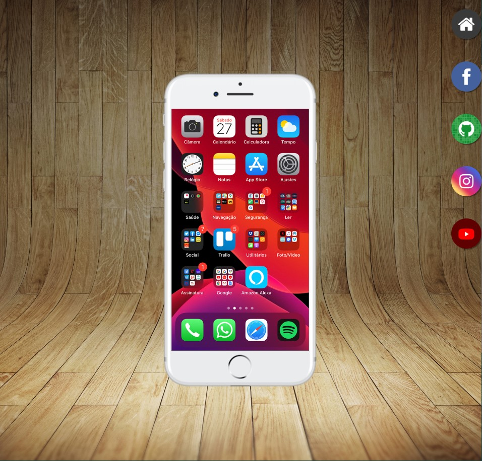

# redes_sociais
o objetivo deste site é apresentar as redes sociais do autor de uma forma mais interativa e criativa, exibindo-as em um iframe com um visual de um iphone, como uma forma de praticar e exercitar os conhecimentos adquiridos com as aulas do curso de html e css do <a href = "https://www.youtube.com/playlist?list=PLHz_AreHm4dkcVCk2Bn_fdVQ81Fkrh6WT" style="color:white; font-weight:bold;" target="_blank">Curso em vídeo</a>

<a href="https://gabrielsperoto.github.io/redes_sociais/" target="_blank" style="color:white; font-weight:bold; font-size: 1.2em; text-align: center;">Acesse o site clicanco aqui</a>